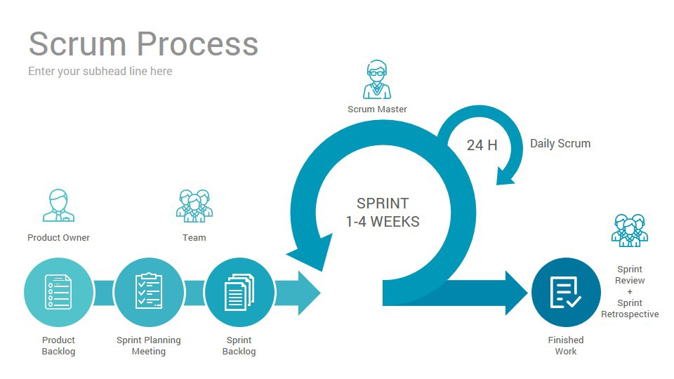

# 2. **소프트웨어 프로세스**

## **소프트웨어 개발 프로세스**
- 프로젝트를 소규모 작업으로 구성하는 일반적인 접근방법
- 관리자와 팀원들이 다음 사항을 결정하는데 도움
    * 무엇을 해야하는가?
    * 어떤 순서로 작업할 것인가?
- 모델을 작업 방식을 엄격하게 규정하기 보다는 생각하는데 도움을 주어야 함
- 각 프로젝트는 고유의 계획을 가지고 진행되어야 함

## **즉흥적인 개발 프로세스**

좋은 엔지니어링 과정을 따르지 않았을때 발생하는 문제들
- 구현하기 전에 요구나 설계 등의 중요성을 인식하지 못함
- 설계가 잘되지 않는다면 소프트웨어의 질이 떨어질 수 있음
- 계획이 없음으로 인해 목표없이 일하게 됨
- 체계적인 테스트나 품질 보증 같은 작업의 필요성을 간과하게 됨
- 이상의 이유로 개발과 유지보수 비용이 증가함

## **대표적인 소프트웨어 개발 프로세스모델**
- 폭포수 모델
- 프로토타입 모델
- 점증적 모델
- 나선형 모델
- 진화적 모델
- 애자일 모델

## **폭포수 모델**

- 도입
    * 1970년 항공 방위 소프트웨어 개발 경험을 통해
- 특징
    * 각 단계가 다음 단계 시작 전에 끝나야함
    * 순서적 : 각 단계 사이에 중복이나 상호작용이 없음
    * 각 단계의 결과는 다음 단계가 시작되기 전에 점검
    * 바로 전 단계로 피드백
- 적용
    * 요구사항을 잘 이해하고 있거나 요구사항의 변경이 한정적인 상황에 적합
    * 대규모 시스템 공학 프로젝트에서 주로 사용됨
- 결과물 정의가 중요하다

 

- 단점 
    * 프로세스 진행 후 변경 수용하기 어려움
    * 초기 단계를 지나치게 강조하면 코딩, 테스트가 지연됨
    * 각 단계의 전환에 많은 노력필요
    * 프로토타입과 재사용의 기회가 줄어듦
    * 소용 없는 다수의 문서를 생산할 가능성 있음

- 대표적 표준
    * MIL-STD-2167
        + general system lift cycle
        + software develpment cycle
    * ISO/IEC 12207
    
## **프로토타입 모델**

- 인간-기계 상호작용 프로토타입
- working 프로토타입 : 소프트웨어 기능의 일부분 실현
- throw-away 프로토타입 : 시스템 요구사항을 이해하기 위한 목적
- 요구되는 기능의 일부 또는 전체 수행 <= 개선을 목표로 함

## **점증적 모델**

- 개발 사이클이 짧은 환경
    * 빠른 시간 안에 시장에 출시하여야할 경우(시장을 먼저 선점하기 위해서)
    * 이를 위해 시스템을 나누어 릴리스
- 릴리스 구성 방법
    * 점증적 방법: 기능 별로 릴리스
    * 반복적 방법: 릴리스 할 때마다 기능의 완성도 높임
- 단계적 개발
    * 기능이 부족하더라도 초기에 사용, 교육 가능
    * 처음 시장에 출시된 소프트웨어는 시장을 빨리 형성할 수 있음
    * 자주 릴리스하면 가동 중인 시스템에서 일어나는 예상하지 못했던 문제를 신속하고 꾸준하게 고쳐나갈 수 있음
    * 개발 팀이 릴리스마다 다른 전문 영역에 초점을 둘 수 있음

## **나선형 모델**

- 소프트웨어의 기능을 점증적으로 개발
    * 실패의 위험을 줄임
    * 테스트 용이
    * 자연스런 피드백
- 여러 번의 점증적인 릴리스
- 진화 단계
    * 계획 수립(planning): 목표, 기능 선택, 제약 조건의 결정
    * 위험 분석(risk analysis): 기능 선택의 우선순위, 위험 요소의 분석
    * 개발(engineering): 선택된 기능의 개발
    * 평가(evaluation): 개발 결과의 평가
- 적용
    * 대규모 시스템 개발에 적합
        + 위험을 줄여주는 역할을 함
- 특징
    * 반복적인 개발 및 테스트
    * 강인성 향상
- 단점
    * 관리가 중요
    * 위험 분석이 중요

## **진화적 모델**

- 반복적이며 점증적인 방법
    * 초기에 사용자가 요구사항을 파악하기 힘들고 구현이 어려운 경우
    * 요구사항 분석을 한 번 이상 반복한다.
        + version이 바뀔때 마다 완성도가 높아진다.

 

- UP(Unified Process)
    1. 도입 단계 : 프로젝트의 범위를 설정하고 목표를 명확하게 함
    2. 정련 단계: 시스템의 중요한 요구를 찾아내어 기본이 되는 설계를 완성
    3. 구축 단계: 제조 단계, 원시 코드가 완성되고 모든 중요한 요구의 테스트가 마무리 됨
    4. 전환 단계: 사용자에게 릴리스

## **애자일(Agile) 프로세스**

> [이미지 출처: https://www.vacationclubsoftware.com/post/spi-and-agile-software-development]

- 특징 
    * 설계가 변경되어도 잘 수용할 수 있도록 짧게 반복하면서 개발하는 방법(대규모 X -> 소규모 O)
    * 짦은 릴리스와 반복 : 작업을 작은 조각으로 나누어 되도록 자주 릴리스
    * 점증적 설계: 설계에 대한 결정을 미루고 더 많은 지식이 쌓였을 때, 설계를 개선
    * 사용자 참여: 처음부터 변하지 않는 완벽한 구현을 이루려고 하기보다는 사용자를 참여시켜 계속 피드백 제공
    * 문서 최소화: 필요한 문서만 최소로 작성, 원시 코드가 문서화의 실체
    * 비공식적 커뮤니케이션: 형식적인 문서보다 지속적인 대화
    
## **익스트림 프로그래밍(eXtreme programming)**
* 최초의 애자일 프로세스
* 계획 비즈니스 우선순위와 기술적인 예측을 토대로 기능 결정
* 메타포: 정형화된 아키텍처 대신 메나포를 사용
* 간결한 설계: 불필요하게 복잡한 부분은 제거
* 테스트 중심 개발: 실제 코드를 쓰기 전에 먼저 테스트코드를 작성
* 설계 개선(리팩토링): 동작의 변경 없이 시스템을재구성하고 설계를 개선
* 코딩 표준: 코딩 과정에 동일한 규칙 적용
* 페어 프로그래밍: 컴퓨터를 공유하며 개발과 테스팅 역할을 분리
* 지속적 통합: 항상 실행되는 시스템을 유지하도록 여러 번 통합하고 빌드
* 짧은 릴리스: 2~4주
* 적정 속도:주당 40시간
* 고객참여: 팀에 고객이 합류하여 항상 질문에 답할 수 있도록 준비

 

과정
1. 계획하기
    * 사용자의 스토리를 작은 부분으로 나누기
    * 사용자의 스토리와 연관된 정보 수집
    * 작업을 수행하기 위한 시간및 비용 준비
2. 분석하기
    * 스토리의 우선순위를 정함
    * 예산을 책정
    * 반복할 시간을 책정
3. 설계하기
    * 과업을 나눈다
    * 작업 별 테스트 시나리오 준비
    * 자동화 프레임워크로 반복한다
4. 실행하기
    * 코딩
    * 테스트
    * 수동의 작업을 자동화 프레임워크로 변환
    * 중간 반복 검토
    * 반복 검토 종료
5. 포장하기
    * 작은 릴리즈 출시
    * 데모후 검토
    * 고객 니즈에 따른 개발
    * 반복 종료시 프로세스 개선
6. 종료
    * 제품 테스트를 위한 파일럿 출시
    * 제품 출시
    * 제품 지원

## **스크럼(Scrum)**

> [이미지 출처: https://brainhub.eu/blog/differences-lean-agile-scrum/]

팀원들이 스크럼을 짜듯이 조직적으로 애자일 방법론을 적용함

- 구성요소
    * 백로그
        + 대략적인 할 일 목록
        + SRS에 해당하는 목록
    * 스프린트
        + Iteration을 의미, 1~4주 정도의 기간
        + 스토리를 개발하고 설치
    * 스크럼 회의
        + 매일 15분간 진도 확인 회의
    * 리뷰
        + 스프린트 종료 후 구현된 산출물을 리뷰
    * 스프린트 회고
        + 방법론 자체에 대한 리뷰 수행

## **프로젝트 모델 선정**
|프로젝트 타입|프로젝트 특성|프로세스 모델
|---|:---|:---|
|일반적인 구축|- 위험성이 적고, 기존에 진행된 유사사례가 많은 경우 - 한정된 자원에 대한 제약 존재|폭포수모델
|대규모 재구축|- 대규모 프로젝트인 경우 - 프로젝트의 위험성이 높고, 연관 도메인이 많은 경우 - CBD 방법론을 활용해야 하는 경우 - 향후 변경의 여지가 많고, 요구사항 확정이 어려운 경우|점증적 모델 나선형 모델
|임베디드 시스템|- 소프트웨어 외에 여러요소(하드웨어, 사용자 인터페이스)를 고려해야 하는 경우|점증적 모델
|프로젝트 타당성 검토|- 프로젝트를 수행해야 하는지에 대한 여부 결정이 어려울 때 - 타당성 검증을 필요로 하는 경우|프로토타입 모델 나선형 모델
|연구형 개발|- 요구사항이 불명확하고, 지속적인 검증이 필요 - 대규모의 비용이 확보되어 있음|프로토타입 모델 나선형 모델
|소규모|- 단기간 내 요구사항 만족 - 자동화 도구 사용 가능 - 고객의 참여를 통한 효율성 확보|애자일 프로세스

## **Process Activities**
- Software specification
- Software design and implementation
- Software validation
- Software evolution

## **Software specification**
어떤 서비스가 필요한지 시스템의 운용/개발에 대한 제약 사항이 무엇인지 확립하는 과정

- Requirements engineering process
    * Feasibility study(타당성 조사)
    * Requirements elicitation and analysis(요구사항 도출 및 분석)
    * Requirements specification(요구사항 명세)
    * Requirements validation(요구사항 검증)

- Software specification

## **Software design and implementation**
시스템 명세를 실행 가능한 시스템으로 변환하는 프로세스
- Software design
    * 명세를 실현하는 소프트웨어 구조 설계
- Implementation
    * 이런 구조를 실행 가능한 프로그램으로 변환

- Design process activities
    * Architectural design
    * Interface design
    * Component design
    * Data structure design
    * Algorithm design

- Design Process

## **Programming and debugging**
설계를 프로그램으로 변환하고 프로그램에서 오류 제거하는 프로세스
 
프로그래머는 프로그램의 결함을 발견하고 디버깅 프로세스에서 이러한 결함을 제거하기 위해 프로그램 테스트를 수행한다.

## **Software validation**
- Verification and validation(V & V)
    * 시스템이 명세에 부합하고 시스템 고객싀 요구사항을 충족한다는 것을 보여주기 위한 활동
    * Component or unit testing
        + 개별 컴포넌트를 독립적으로 테스트
        + 컴포넌트는 기능이나 객체 또는 이러한 기능/객체의 연관성 있는 그룹
    * System testing
        + 시스템 전체 테스트
        + 명세에서 유도된 테스트 케이스를 가지고 시스템을 실행하는 테스트
    * Acceptance testing
        + 시스템이 고객의 요구를 충족하는지를 확인하기 위해 고객의 데이터를 이용하여 테스트
    
- Testing Phase
    
## **Software evolution**
소프트웨어는 본질적으로 유연하고 변경될 수 있음 
변화하는 비즈니스 환경에 따라 요구사항이 변화함에 따라 비즈니스를 지원하는 소프트웨어도 진화하고 변화해야 한다.

- System evolution
    