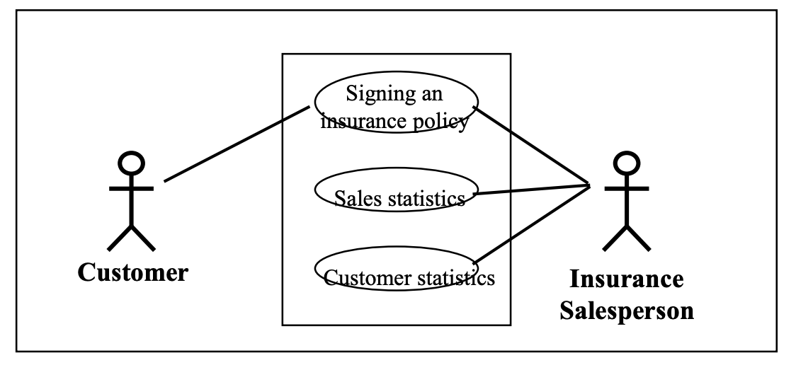
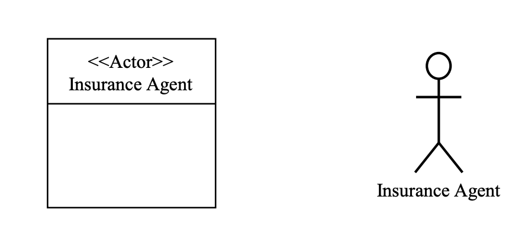
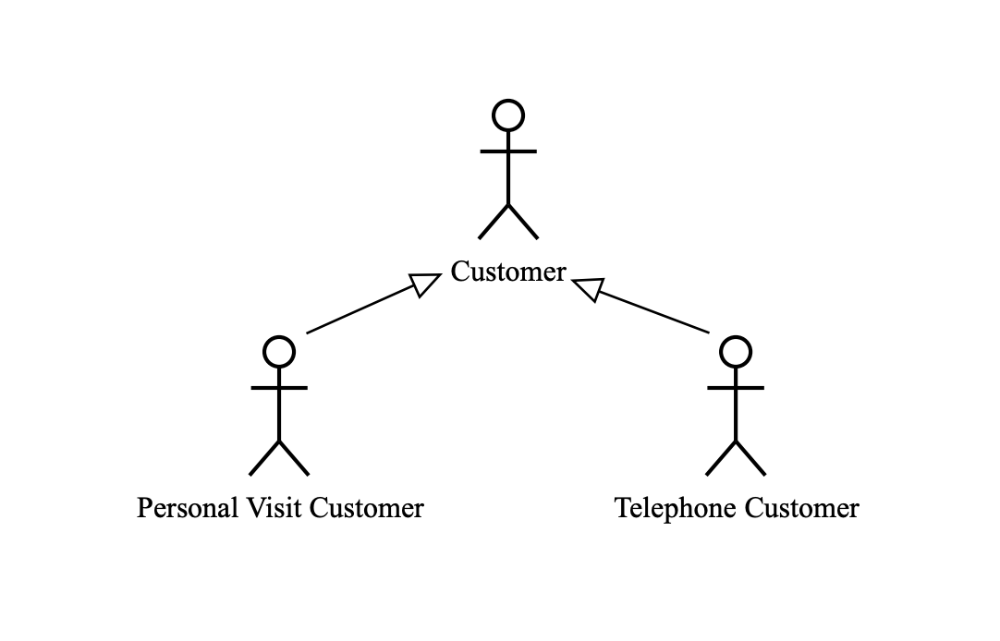
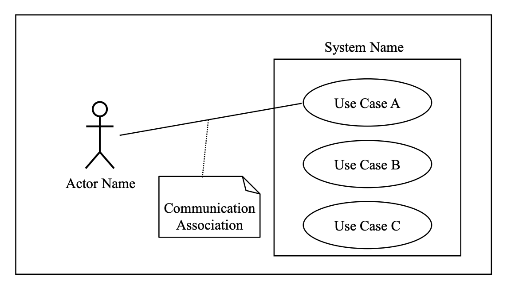
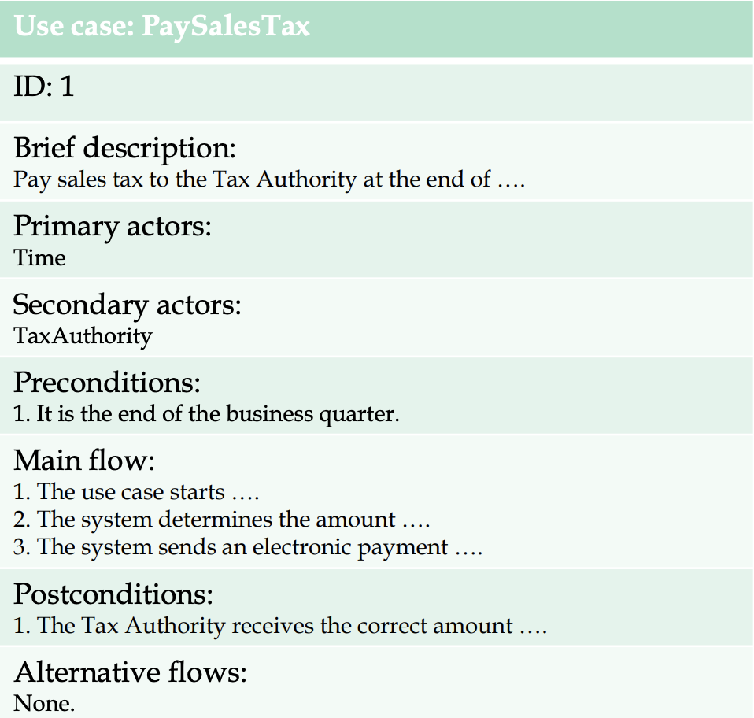
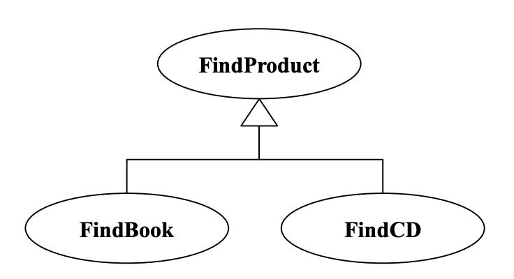
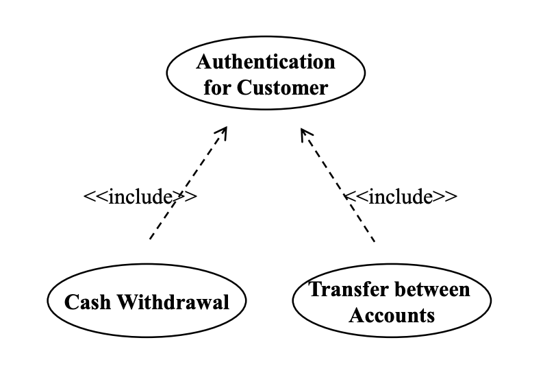
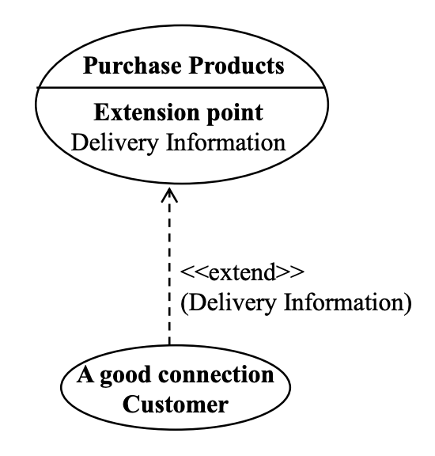
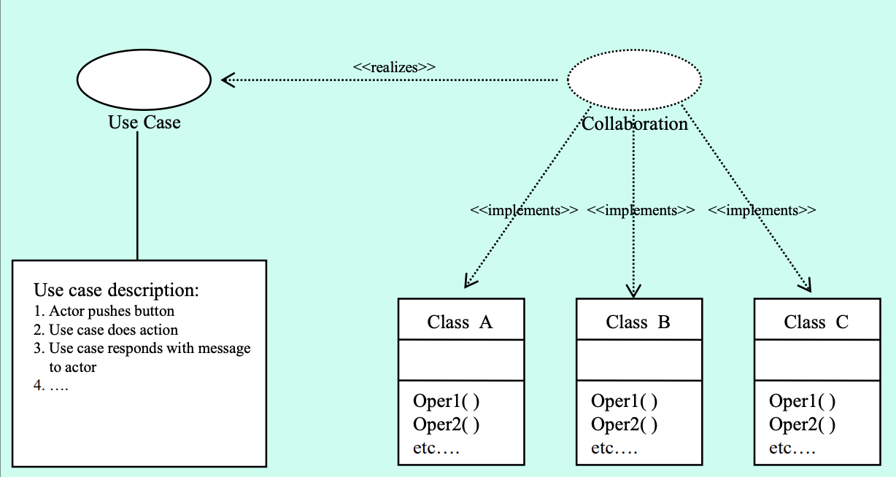

# **유스케이스 모델링**

## **유스케이스**
유스케이스
- 유스케이스는 시스템이 액터에게 관찰 가능한 가치의 결과를 생산하기 위해 수행하는 일련의 행동 및 그 변형들의 집합
- 유스케이스는 완전한 기능을 명세함
    * 기능은 시스템의 경계를 정의한다
- 유스케이스는 프로세스를 묘사한다
- 프로세스는 조직이나 액터에게 가치 있는 것을 생산하기 위해 필요한 사건(events), 행동(actions) 및 거래(transactions)의 연속
    * 계좌에서 현금 인출
    * 제품 주문
    * 강좌 등록

 

**시나리오 vs 유스케이스**
- 시나리오는 특정한 목표를 달성하기 위해 수행되는 일련의 행동이다.
- 유스케이스는 주어진 기능에 대해 가능한 모든 시나리오 집합을 정의한다.
    * 시나리오는 유스케이스의 한 예임
- ex) A"handle withdraw request on account with insufficient funds" scenario is an instance of a "handle withdraw request" use case

**유스케이스의 목적**
- 시스템의 기능 요구사항을 결정하고 기술
    * 고객과 소프트웨어 개발자 간의 합의로 귀결됨
- 시스템이 무엇을 해야 하는지에 대해 명확하고 일관된 설명 제공
    * 개발 프로세스 전반에 걸쳐 이러한 요구사항을 모든 개발자에게 전달하기 위해 사용됨
- 시스템을 검증하기 위한 시스템 테스트를 수행할 수 있는 근거 제공
- 기능 요구사항에서 시스템의 실제 클래스 및 오퍼레이션으로 추적할 수 있는 기능 제공
- 유스케이스 모델을 변경하여 시스템의 변경 및 확장을 단순화 함

**유스케이스 다이어그램**
- 외부 액터와 시스템이 제공하는 유스케이스와의 연결성을 보여줌
- 사용자 관점에서의 시스템 동작만을 설명
- 다음과 같은 모델 요소를 포함
    * 시스템, 액터, 유스케이스
- 유스케이스에 대한 설명은 일반 텍스트로 기술

## **유스케이스 모델링 절차**
1. 시스템 정의
2. 액터 찾기
3. 유스케이스 찾기
4. 유스케이스 기술
5. 유스케이스 간의 관계 정의
6. 유스케이스 모델 검증
 

**1. 시스템 정의**
시스템
- 개발될 시스템의 경계
- 소프트웨어 시스템, 비즈니스 또는 기계
- 시스템의 경계와 전반적인 책임을 정의하는 것이 항상 쉬운 것은 아님
    * 기본 기능 식별하기

 

**2. 액터 찾기**
- 액터는 시스템과 상호 작용할 때 외부 에이전트가 수행하는 역할 
    * 외부 에이전트는 사람, 하드웨어 장치 또는 다른 자동화된 시스템일 수 있음
    * ex) 은행 시스템의 경우, 사람은 *대출 담당자의 역할*을 수행 할 수 있으며, 동일한 사람이 또한 그곳에 계좌를 가지고 있다면, *고객 역할*을 할 수 있다.
- 액터는 유스케이스를 수행함
    * 주 액터(primary actors)
        + 결과를 담당, 주 기능
    * 부 액터(secondary actors)
        + 자원을 담당, use case가 잘 작동되도록 기능(부기능)
- 유스케이스는 다음을 갖음
    * 하나의 initiating actors(stimulus)
        + 시스템에 메시지를 보내는 역할 수행
    * 여러 개의 paricipating actors 가능

액터 찾기
- 누가 시스템의 주요 기능을 사용할 것 인가?(주 액터)
- 누가 그들의 일상 업무를 수행하기 위해 시스템의 지원을 필요로 하는가?
- 누가 시스템을 유지, 관리 및 시스템의 작동을 지속해야 하는가?(부 액터)
- 시스템에서 처리해야 할 하드웨어 장치
- 시스템이 처리해야 할 하드웨어 장치는?
- 누가 시스템이 생성하는 결과에 관심이 있는가?

 
UML에서의 액터

- 액터 클래스는 속성과 행위를 둘 다 가질 수 있음

 

액터 간의 일반화

 

**3. 유스케이스 찾기**

유스케이스의 특성
* 항상 액터에 의해 개시됨
* 액터에게 가치를 제공함
* 완전한 설명 이어야 함
    + 유스케이스를 너무 작은 유스케이스로 나누지 않아야 함
    + 최종 값이 생성될 때까지 유스케이스는 완전한 것이 아님

유스케이스 찾기
- 이전에 정의한 액터로부터 시작
    * 액터가 시스템에 요구하는 기능은 무엇인가? 그 액터는 무엇을 해야 하는가?
    * 액터는 시스템의 어떤 종류의 정보를 읽거나, 만들거나, 파괴하거나, 수정하거나, 저장하는가?
    * 시스템에서 발생하는 이벤트에 대해 액터에게 알려야 하는가, 아니면 액터가 시스템에 알려야 하는 것이 있는가? 이러한 이벤트는 기능 면에서 무엇을 나타내는가?
- 현재의 액터와 관련되지 않는 기타 질문
    * 시스템에 필요한 입/출력은 무엇인가? 이런 입출력은 어디에서 오거나 어디로 가는가?
    * 현재 이 시트엠의 구현에서 가장 큰 문제점은 무엇인가?

- UML에서의 유스케이스
    

**4. 유스케이스 기술**
- 유스케이스의 목적
    * 궁극적인 목표
- 유스케이스의 시작방법/시기
    * 액터
    * 상황들
- 액터와 유스케이스 사이의 전형적인 메시지 흐름
- 유스케이스의 대체 흐름
    * 그것들은 너무 자세히 설명하지 않아야 함
- 액터에게 가치를 부여하여 유스케이스를 완료하는 방법/시점
- 참여 액터와의 상호작용 시점

- 유스케이스 기술
    * 텍스트
        + 고객이 이해하고 검증할 수 있도록 명확하고 일관성이 있어야 함
        + 복잡한 문장을 피해야 함
    * 액티비티 다이어그램
        + sequence of activities, ordering, and optional decisions

- 유스케이스 템플릿
    

**5. 유스케이스 간의 관계 정의**
- 일반화
    * 자식 유스케이스는 부모의 행위를 계승
    * 자식 유스케이스는 부모 행위의 일부를 우선할 수 있음. 또한 행위 추가 가능
    * 부모 유스케이스가 예상되는 곳이라면 어디든 자식 유스케이스를 사용할 수 있음
    

- 포함 관계
    * 다수의 유스케이스가 공통적인 행동을 수행하는 경우, 이러한 행동은 단일 유스케이스로 모델링 될 수 있으며 이 유스케이스는 다른 유스케이스에 포함된다.
    * 유스케이스는 특정 위치에서 다른 유스케이스를 포함할 수 있다
        + 여러 유스케이스에 걸쳐 동일한 이벤트 흐름의 작성을 피하기 위해 사용(복수 사본 방지용)
        + 포함되는 유스케이스가 그 자체로 완전할 경우
            + 일반적인 유스케이스와 마찬가지로 즉시 사용 가능
            + c.f. 불완전한 경우: 인스턴스화 할 수 없는 유스케이스
    * << include>>: 함수 호출과 유사
        + included use case로 제어 이동, included use case 수행 후 제어 복귀
    

- 확장 단계
    * 한 유스케이스의 확장 지점(extension point)에 액션을 추가하여 다른 유스케이스로 확장함
    * 기본적으로 확장 관계는 일반화 관계와 유사
    * 유스케이스는 기반 유스케이스의 지정된 위치에서 추가행위를 합병하여 기반 유스케이스를 확장할 수 있다
        + 기반 유스케이스는 독립된 유스케이스로 작용할 수 있다
        + 기반 유스케이스는 확장 지점이라고 불리는 특정 지점에서만 확장할 수 있다
        + 예외에 따다 실행되는 별도의 흐름을 모델링 하는데도 사용됨
        + 조건 확장(conditional extension)
            + 조건은 불리안 수식
            + 불리안 수식이 참일 때만 확장이 이루어짐

    

**6. 유스케이스 모델 검증**
- 검증
    * 시스템이 올바르게 개발 되었는가, 또는 만들어진 명세에 따라 개발되었는가?
    * 구현을 테스트
- 확인
    * 시스템이 고객 또는 최종 사용자의 요구를 충족시키는가?
    * 개발 프로세스 초기에 수행(유스케이스 모델링 후)
- 유스케이스 워크쓰루(walking the use cases)
    * 역할극: 액터 그룹, 시스템 그룹
    * 역할극에 참여하지 않은 개발자는 메모를 하고 유스케이스에서 결함을 찾으려고 노력한다.
    * 몇 가지 대안을 찾을 수 있다.
- 유스케이스 실현
    * 유스케이스는 collaboration으로 실현
    * 유스케이스 내의 단계와 행동을 클래스, 오퍼레이션 및 이들 간의 관계로 변환
    * 각 단계의 책임을 collaboration에 참여하는 클래스에 할당(반복 작업)

    
