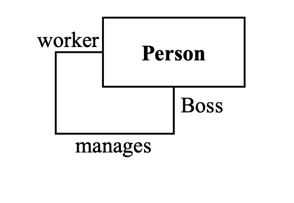
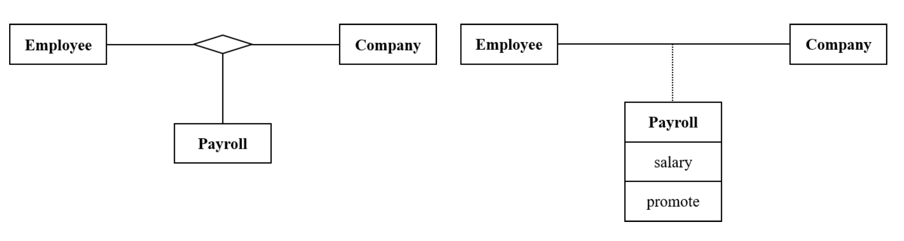

# **클래스 모델링**

## **클래스 모델링 프로세스**
- 모델링 프로세스
    1. 객체 파악
    2. 클래스 선택
    3. 연관관계(associations) 파악
    4. 속성(attributes) 파악
    5. 상속을 이용한 단순화
    6. 클래스에 책임(responsibilities) 할당
    7. 오퍼레이션(operations) 파악
    8. 모델 테스트
    9. 반복 및 정체

## **1. 객체 파악**
- 객체 파악
    * 다음 기준을 사용하여 문제정의서(problem statements)의 모든 명사(noun)에 밑줄을 긋는다.
        + 문제정의서의 명사로부터 시작한다.
        + 문제와의 관련성을 유일한 선정기준으로 사용
        + 이때 집합(Aggregation)이나 일반화(generalization)을 이용하여 정리하려 하지 않는다.
        + 이 시점에는 객체와 속성을 구분하려 하지 않는다.
    
## **2. 클래스 선택**
- 클래스 선택
    * 중복 클래스 제거
    * 문제와 관련 없는 클래스 제거
    * 속성이 되어야 하는 클래스 제거
        + 객체를 묘사하는 이름은 객체가 아닌 속성
    * 오퍼레이션이 되어야 하는 클래스 제거
        + 클래에스 적용되는 오퍼레이션을 설명하는 이름
    * 역할이 되어야 할 클래스 제거
        + ex) 웨이터, 버스보이 vs 직원
    * 구현과 관련된 구성요소 제거
        + ex) 테이블, 트리(데이터 구조), CPU, 서브루틴, 알고리즘
    * 모호한 클래스는 명확하게 함

- 클래스 다이어그램 생성
    * 프로세스 초기에 클래스 다이어그램 구축
    * 클래스 선택 단계 중 발견된 클래스로 클래스 다이어그램 작성을 시작
    * 다이어그램을 활용하여 전문가 및 사용자의 입력 자극
    * 수집된 모든 정보의 저장소로 클래스 다이어그램을 활용
    * 프로세스 전반에 걸쳐 클래스 다이어그램은 지속적으로 변경됨

## **3. 연관관계 파악**
연관관계 파악
1. 클래스 간의 연관관계(association)및 집합단계(aggregations) 파악
2. 연관관계 제거
3. 각 연관관계에 대한 다중성 결정
4. 연관관계 세분화
    * 잘못된 명칭의 연관관계 수정
    * 모호한 연관관계를 명확하게 함
    * 고차(higher order)의 연관관계를 분해함

**1. 연관관계 및 집합관계 파악**
- 연관관계 및 집합관계는 문제정의서에 동사 또는 동사구문으로 기술되어 있다.
    * 물리적 위치(~의 옆, ~의 일부, ~에 포함됨)
    * 방향성을 갖는 행동(drives)
        + 세급은 급여에서 공제됨
    * 통신(~와 이야기함)
    * 소유권(보유함, ~의 일부)
        + 회사는 호텔과 레스토랑을 보유하고 있다
    * 어떤 조건의 만족(~를 위해 일함, 관리함)
        + 회사에서 근무하는 직원
- 연관관계는 둘 이상의 클래스 간의 관련성이 존재함을 의미
- 집합관계는 물리적인 위치나 소유권을 통해 둘 이상의 클래스를 연관시키는 연관관계의 강한 형태이다
- 초기에는 연관관계와 집한관계를 구분할 필요 없음

**2. 연관관계 제거**
- 제거된 클래스와 관련된 연관관계
- 구현에 특화된 연관관계
- 문제와 관련 없는 연관관계
- 중복되는 연관관계
    * 다른 연관관계에 의해 정의될 수 있는 연관관계

**3. 다중성 결정**
- 연관관계가 선택사항인가, 즉 0을 범위에 포함시켜야 하는가?
    * 클래스의 모든 인스턴스에 대해 링크가 존재하지 않는다면 연관관계는 선택 사항(optional)이다
- 연관관계는 1대1 인가, 즉 범위가 1이어야 하는가?
    * 응용프로그램 도메인에 둘 이상의 인스턴스가 연계될 수 있는 상황이 존재한다면, 그것은 일대일 관계가 아니다. 일대일 관계인 연관관계는 거의 존재하지 않는다.
- 연관관계가 다수 대응 관계인가, 즉 범위가 둘 이상의 관계를 허용하는가?
    * 둘 이상의 인스턴스를 연결할 수 있는 경우, 연관관계는 다수 대응 연관관계이다.

**4. 연관관계 세분화**
- 잘못된 명칭의 연관관계 수정
    * 연관관계가 어떻게 발생했는지가 아니라, 무엇인지를 말하라
    * 오퍼레이션은 연관관계는 아니나, 클래스 사이에 연관관계가 존재할 가능성이 있다는 지표임
    * 두 클래스 간의 다중 오퍼레이션은 다중 연관관계로 나타날 필요는 없음. 하나의 연관관계로 표현하면 됨
        + 인쇄시스템에서 프린터는 그것과 연관된 큐를 갖고 있음. 큐와 관련된 여러 오퍼레이션이 정의됨
            + 프린터는 큐에 있는 항목들의 순서를 변경할 수 있음
            + 프린터는 대기 중인 항목을 삭제할 수 있음
            + 프린터는 큐에 대한 액세스를 거부할 수 있음
            + 프린터는 큐 오버플로를 처리함
        + 프린터와 큐 사이에는 하나의 연관관계만 표현: 즉 '프린터가 큐에 연결됨'과 같은 형태

- 모호한 연관관계를 명확하게함
    * 연관관계의 끝을 식별할 역할(role) 이름 추가
    * 재귀 연관관계(reflexive association)에 특히 중요하다
    * ex) "사람이 사람을 관리함"은 "Boss가 worker를 관리함" 이어야 한다.
    
- 고차(higher order)의 연관관계를 분해함
    * 3개 이상의 클래스 사이의 대부분의 연관관계는 이진 연관관계로 분해할 수 있음
    * 3진 연관관계는 때때로 이진 연관관계와 링크 속성으로 분해될 수 있다.
    

## **4. 속성 파악**
1. 속성파악
    - 문제정의서의 속성
    - 추가 속성
2. 객체 속성 세분화
    - 파생 속성 파악
    - 링크 속성 식별
3. 불필요한 속성 삭제
    - 객체
    - 내부 식별자
    - 내부 상태
    - 잘못 위치한 속성
    - 적정 상세 수준 유지
 

**1. 속성 파악**
- 문제정의서의 속성
    * 속성은 개별 객체의 특성이다.
        + 이름, 주소, 나이
    * 속성은 보통 소유격 뒤에 있는 명사들이다.
        + 직원의 "이름"
    * 형용사는 속성의 특정한 열거된 값일 수 있다.
        + 파란색은 차의 색이다
    * 초기 클래스 목록에서 클래스를 제거할 때 일부 속성이 발견될 수 있음

- 추가속성
    * 대부분의 속성은 문제정의서가 아닌 응용분야의 지식으로부터 발견됨
    * 모든 속성을 나열할 필요는 없다
    * 가장 중요한 속성부터 파악, 세부사항 향상 추가 가능
    * 분석 중에는 구현 만을 위한 속성 회피

**2. 객체 속성 세분화**
- 파생 속성 파악
    * 식별된 속성 중 일부는 실제로 다른 속성에서 파생될 수 있다.
    * 파생된 속성은 구현을 단순화하기 위해 객체 모델에 포함됨
- 링크 속성 식별
    * 속성은 링크에 따라 달라지는가?
    * 링크 속성은 다대다 연관관계에서 자주 발견됨
    * ex) 한 직원이 여러 부서에서 근무할 수 있고 한 부서가 많은 직원을 고용하는 경우

**3. 불필요한 속성 삭제**
- 속성이 실제로 객체인가?
    * 엔터티가 값보다 중요하다면 속성이 아닌 별도의 객체이다.
    * 엔터티가 응용 프로그램 내에서 고유한 특성을 가지고 있는 경우 속성이 아니라 객체이다
- 속성이 실제로 내부 식별자인가?
    * 식별자가 내부 처리를 위한 것이라면, 객체 모델의 일부가 아니어야 함
    * ex) 사원번호 vs 로그번호
- 속성이 실제로 숨겨진 내부 값인가?
    * 속성이 객체의 내부 상태를 나타내는지 확인
    * 이 내부 상태가 객체 외부에서 보이지 않는지 확인
    * 분석에서 내부값 제거
    * ex) 급여 계산 응용 프로그램 분석 과정에서의 생활비
- 잘못 위치한 속성
    * 하나의 속성이 다른 모든 속성과 완전히 무관한지 확인
    * 이는 클래스가 두 개의 다른 클래스로 분할해야 함을 의미할 수 있다.
    * 각 클래스는 단순하고 응집력이 있어야 한다.
    * 집중되지 않은 클래스는 명확하고 세분화 되어야 함
- 적정 상세 수준 유지
    * 분석 시 주요 속성만 유지
    * 각 속성이 대부분의 오퍼레이션에 영향을 미치는지 확인
    * 사소한 영향만 갖는 속성의 경우 삭제
    * ex) 자녀수 vs 부양가족수

## **5. 상속을 이용한 단순화**
- Bottom up
    * 클래스를 검색하고 유사한 속성, 연관관계 또는 오퍼레이션 검색
    * 슈퍼클래스를 정의하고 공통속성, 연관관계 또는 오퍼레이션을 슈퍼클래스에 할당
        + 시간제 직원, 월급제 직원 => "직원"
        + 공통 속성: 이름, 주소, 사회 보장 번호
        + 공통 오퍼레이션: 고용(hire), 부서 할당, 승진
    
- Top down
    * 기존 클래스를 특수화된 하위 클래스로 세분화
    * 애플리케이션에서 다르게 처리될 경우 하위 클래스를 정의해야 함
        + 의무적 공제는 다음과 같이 세분화될 수 있다.
        + 연방세/ 주세/ 지방세

## **6. 클래스에 책임 할당**
- 클래스에 책임(resposibilities)할당
    * 책임이란 시스템이 수행해야 할 일이다.
    * 각 기능적 요구사항은 클래스 중 하나에 귀속 되어야 한다.
        + 주어진 클래스의 모든 책임은 명확하게 관련되어야 한다.
        + 클래스에 너무 많은 책임이 할당된 경우 별도의 클래스로 분할 하는 것을 고려하라
        + 만약 어떤 클래스가 책임을 갖지 않으면, 그것은 쓸모 없을 것이다.
        + 책임이 기존 클래스 중 어디에도 귀속될 수 없는 경우, 새로운 클래스를 생성해야 한다.

    * 책임을 결정하기 위해서는
        + 유스케이스 분석 수행
        + 시스템 설명에서 동작을 설명하는 동사와 명사 찾기

- 책임 범주
    * 속성 값 설정 및 가져오기
    * 새 인스턴스 생성 및 초기화
    * 영구 저장소 로딩 및 저장
    * 인스턴스 제거
    * 수치 결과 계산
    * 복사, 변환, 변형, 전송 또는 출력
    * 탐색 및 검색

## **7. 오퍼레이션 파악**
- 각 클래스의 책임을 실현하기 위해 오퍼레이션이 필요하다
    * 책임당 여러 오퍼레이션이 있을 수 있음
    * 책임을 구현하는 주요 오퍼레이션이 있을 수 있음
    * 책임을 수행하기 위해 협력하는 다른 메소드들은 가능한 한 private이어야 한다

## **8. 모델 테스트**
- 접근 경로
    * 모델 다이어그램을 통해 액세스 경로 추적
        + 고유한 결과가 예상되는 경우 모델이 해달 결과를 산출하는지 확인
    * 질문할 수 있는 질문을 생각해 보고, 모델이 대답하는지 확인
        + 답변할 수 없는 질문이 있다면 모델을 변경하라
- 워크쓰루(work through)
    + 모델을 테스트하기 위해 할 수 있는 모든 작업을 완료한 후
        * 동료들과 함께 검토 주기를 가지거나 워크쓰루를 진행
        * 최종 사용자와 함께 모델에 대해 워크쓰루를 진행
    
## **9. 반복 및 정제**
- 누락된 객체의 징후
    + 명확하게 일반화 하기 어려움: 한 클래스가 두 가지 역할을 수행할 수 있음 -> 분할
    + 오퍼레이션은 적절하지만 타겟 클래스가 적절하지 않음 -> 누락된 대상 클래스 추가
    + 이름과 목적이 같은 두 개의 연관관계 -> 그들을 통합하는 슈퍼 클래스 생성

- 불필요한 클래스의 징후
    + 클래스에 대한 속성 부족
    + 클래스에 대한 오퍼레이션 부족
    + 클래스에 대한 연관관계 부족

- 연관관계 누락의 징후
    + 오퍼레이션에 대한 액세스 경로 누락 -> 새로운 연관관계 추가
    + 모든 질의에 답변할 수 있는지 확인

- 불필요한 연관관계의 징후
    + 여러 연관관계에서 동일한 정보 -> 새 정보를 추가하지 않는 연관관계 제거
    + 연관관계의 경로를 가로지르는 오퍼레이션 부족 -> 이 연관관계가 필요한 오퍼레이션이 없으면 연관관계는 필요하지 않을 수 있음. 오퍼레이션이 완료될 때까지 기다렸다가 결정
- 연관관계의 잘못된 배치에 대한 징후
    + 클래스에 비해 너무 넓거나 좁은 역할 이름 -> 클래스 계층에서 연관관계를 위 또는 아래로 이동