# **클래스 모델링**
## **UML**
Unified Modeling Language는 객체지향 소프트웨어를 모델링 하기 위한 표준 그래픽 언어
- 1980년대 말과 1990년대 초반에 객체지향 개발 프로세스 등장함
- 방법론과 표기법의 확산은 상당한 혼란을 초래함
- Rumbaugh와 Booch는 1994년에 그들의 방법을 통합하기로 결정함
- 1995년에는 다른 방법론자 Jacobson이 팀에 합류
- 1997년에 OMG(Object Management Group)는 UML 표준화 프로세스를 시작

## ** UML 다이어그램**
- 클래스 다이어그램
    * 클래스들과 그들의 관계를 기술
- 상호 작용 다이어그램
    * 객체들이 서로 어떻게 상호작용하는지에 대한 시스템의 동작을 표현
- 상태 다이어그램 및 활동 다이어그램
    * 시스템이 내부적으로 어떻게 행동하는지 보여줌
- 컴포넌트 및 배치 다이어그램
    * 시스템의 다양한 구성 요소가 논리적 및 물리적으로 어떻게 배치되는지 보여 줌

## **UML features**
- 상세한 의미론(semantics)을 가지고 있음
- 확장 메커니즘(extension mechanism)을 가지고 있음
- 관련 텍스트 언어가 있음
    * OCL(Object Constraint Language)
- UML의 목적은 소프트웨어 개발을 돕는 것
    * 방법론이 아님

## **좋은 모델이란?**
- 표준 표기법을 사용해야 함
- 고객과 사용자가 이해할 수 있어야 함
- 소프트웨어 엔지니어가 시스템에 대한 통찰력을 가질 수 있게 유도해야 함
- 추상화를 제공해야 함

- 모델은 다음과 같은 경우에 사용 됨
    * 설계 작성
    * 이러한 설계에 대한 분석 및 검토
    * 시스템을 설명하는 핵심 문서

## **클래스 다이어그램의 기초**
- 클래스 다이어 그램의 구성 요소
    * 클래스: 자료 타입 그 자체를 나타냄. 속성과 오퍼레이션 집합체
    * 연관관계: 클래스 인스턴스 사이의 연계 관계를 나타냄
    * 속성: 클래스와 그 인스턴스 안에서 정의되는 데이터
    * 오퍼레이션: 클래스와 그 인스턴스에 의해 수행될 함수
    * 일반화: 클래스 상속 구조 표현

1. 클래스
- 표현
    * 박스(사각형)으로 표현, 내부에 클래스 이름 명시
    * 세 부분으로 구성: 이름, 속성, 오퍼레이션을 표시
    * 속성과 오퍼레이션은 생략하여 표현할 수 있음
    

2. 속성
- 객체의 상태 또는 성질을 나타내는 자료값
    * 객체에 대한 정보를 나타냄
    * 객체 외부에서 값을 읽어갈 수도 있고, 변경할 수도 있다.
    * 읽기 전용도 가능
    

3. 오퍼레이션
- 박스 내에 오퍼레이션 시그니쳐로 표현
    * 속성에 대한 getter, setter
    * 읽기 전용은 getter 오퍼레이션만
    * 계산을 수행하기 위한 함수
    * 오퍼레이션 signature의 표현
        + operationName(parameterName parameterType,...):return Type
    

4. 가시성 
- 속성과 오퍼레이션 앞에 가시성(visibility)표시
    * public: **+**
    * protected: **#**
    * private: **-**
    

5. 연관관계
- 두 클래스가 서로 어떻게 관련되어 있는지를 표현
    * 연관관계 장식 요소: 연관관계의 특성을 표현
        + 관계 이름(association name): 동사나 동사구로 표현
        + 다중성(multiplicity): 관계 사이에 개입하는 인스턴스의 개수를 의미
        + 역할 이름(role name): 클래스에 의해 수행되는 역할, 링크 양 끝에 표시
        + 방향성(directionality 또는 navigability)
    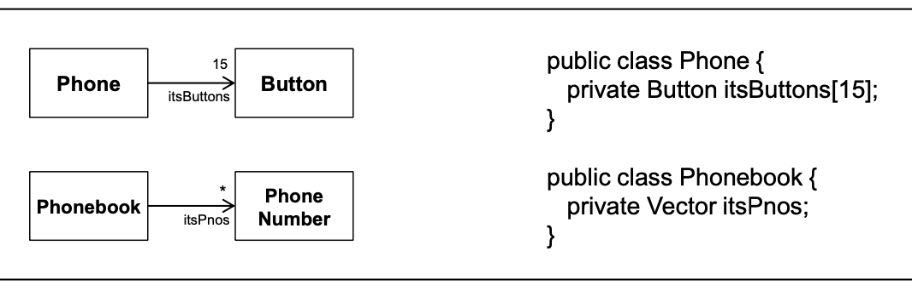
 

**연관관계의 다중성**
- 다중성
    * 다중성을 표시하지 않으면 1로 간주
    * 다수일 때는 *로 표시, 0을 포함한 다수
        + 0..1: 선택적(optional) 관계
        + 1..*: 1개 또는 그 이상
        + 3..5: 3개에서 5개까지
    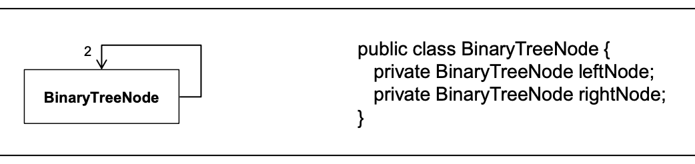

1. One-to-one
    * 한 회사에 오직 하나의 이사회가 있음
    * 이사회는 한 회사를 위한 위원회임
    * 회사는 항상 이사회를 가지고 있어야 함
    * 이사회는 어떤 회사에 소속됨
    

2. Many-to-many
    * 비서 한 명은 여러 명의 관리자를 위하여 일함
    * 관리자 한 사람은 여러명의 비서를 둘 수 있음
    * 비서는 pool에서 일함
    * 관리자들은 비서의 그룹을 가질 수 있음
    * 어떤 관리자는 비서가 없을 수도 있음
    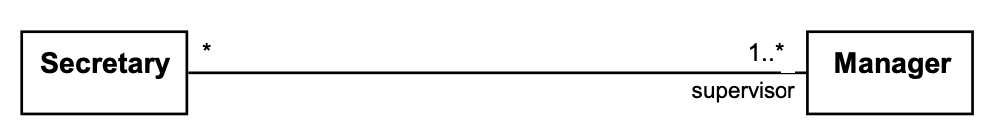

불필요한 1대1 관계 또는 부적절한 연관관계는 피해야함
    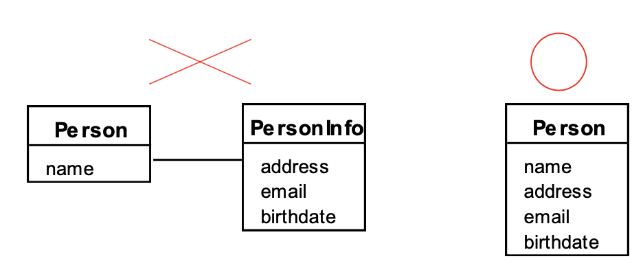
    
- 복잡한 예
    * 예약은 항상 단 하나의 탑승객에 대한 것
        + 탑승객이 없는 예약은 없음
        + 하나의 예약에 여러 탑승객이 관련되지 않음
    * 탑승객이 다수의 예약을 할 수 있음
        + 탑승객이 예약을 하나도 갖지 않을 수 있음
        + 탑승객이 다수의 예약을 가질 수도 있음
    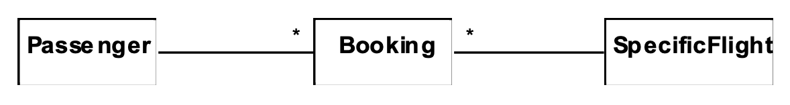

**연관 클래스**
- 두 개의 관련 클래스에 관한 속성을 어느 한 쪽에 위치 시킬 수 없을 경우에 필요한 클래스
    + 다음 두 개의 표현은 동일한 표현
    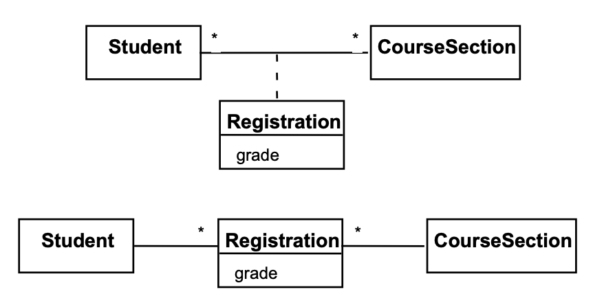

**재귀 연관관계**
- 클래스 자신과 연관관계를 맺음
    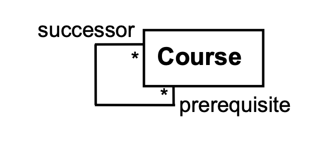

**연관관계의 방향성**
- 연관관계는 기본적으로 양방향성(bi-directional)
- 연관관계의 한 쪽 끝에 화살표를 추가함으로써 연관관계의 방향성을 제한할 수 있음
    + 예) 아래의 클래스 다이어 그램
        * 클래스 인스턴스 Day는 그날에 연관된 Note 인스턴스를 알 필요 없음
        * 그러나 메모 내용을 가지고 해당된느 날짜를 찾아내는 기능이 필요 없음
    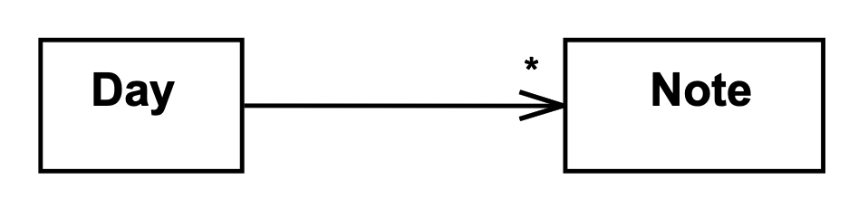

## **인스턴스 다이어그램**
- 클래스의 인스턴스들 간의 관계를 표현
    * link는 연관관계의 인스턴스
    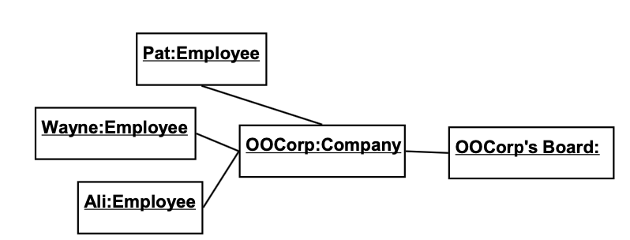

**전체/부분 관계**
- Aggregation: 전체/부분(whole-part)관계를 나타내는 특수한 연관관계
    * 전체에 해당하는 클래스는 aggregate 또는 assembly라 부름
    * 다이아몬드 심볼은 PartOf 관계를 나타냄
    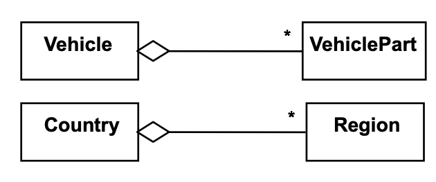

- Aggregate를 사용하는 경우
    * 다음의 관계가 성립하면 aggregate를 사용
        + 'is a part of' 관계가 성립할 때
            + 어떤 요소는 전체의 부품이다.
        + 'is composed of' 관계가 성립할 때
            + 형광등은 새시, 램프, 안정기로 구성된다.
    * 어떤 것이 전체를 제어하거나 소유하고 있으면 그것은 부분도 제어하거나 소유함
    * 집합관계(aggregation)
        + 전체/부분 관계에서 부분 스스로도 존재할 수 있는 관계
        + 흰색 다이아몬드로 표시
        + ex) 자동차와 엔진, 동호회와 동호회 회원의 관계

- Aggregation 계층구조
    * 집합관계의 계층 구조
        + 다른 일반적인 연관관계와 달리 계층 구조로 표현할 수 있음
    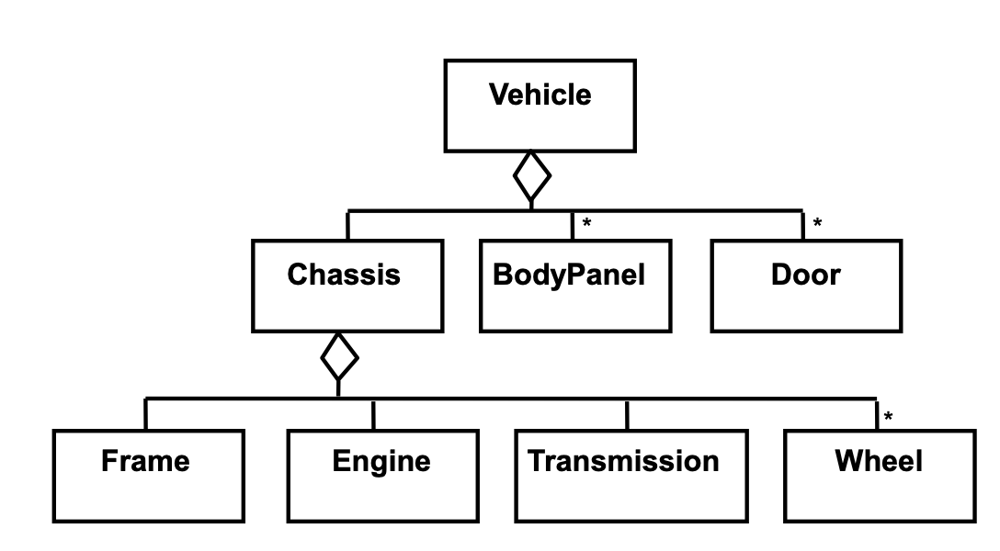
    
**Composition 관계**
- Composition은 aggregation이 강한 관계
    * 전체가 소멸되면 부품도 소멸됨
    * 내포된 의미
        + Room의 한 인스턴스를 두 Building이 동시에 소유하지 못한다.
        + Building은 Room의 수명 전체에 책임을 진다.(Building 소멸 시 동시에 소멸 됨. 복사 시 같이 복사됨.)
    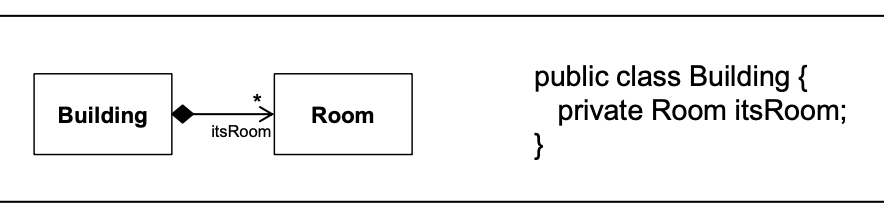

**일반화 관계**
- 일반화 관계
    * 일반화: 두 가지 이상의 클래스의 공통 요소를 일반화
    * 상세화: 수퍼클래스의 요소를 서브클래스로 구체화
    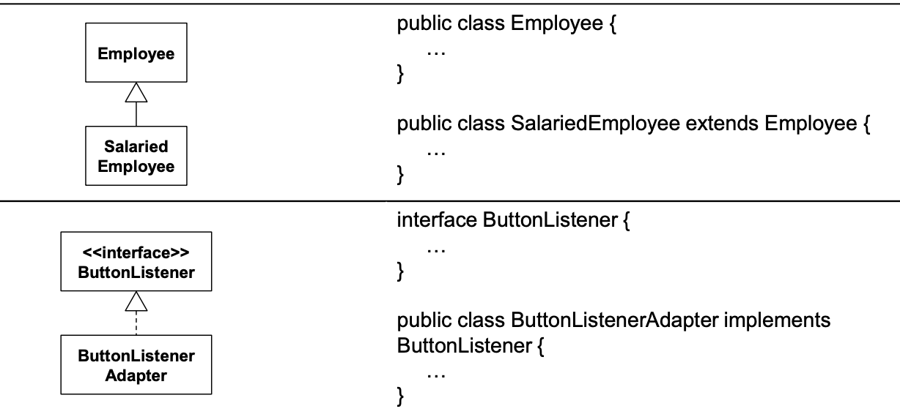

**불필요한 상속 피하기**
- 인스턴스가 되어야 할 것을 무리하게 클래스 구조로 상속한 예
    * 간과한 점: 상속 관계 안에 있는 여러 클래스가 서로 다른 오퍼레이션을 어느 정도 가지고 있어야 하나 그렇지 않음
    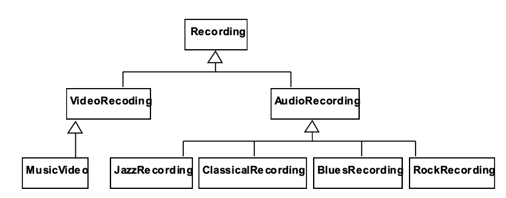

    * 개선 후 인스턴스 다이어 그램
    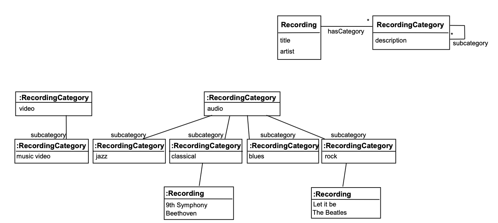

**인스턴스 변경 클래스 피하기**
- 인스턴스는 클래스를 변경하지 않아야 함
    * 문제점: 학생 인스턴스가 두 클래스 사이를 오가게 됨(상태와 상속이 혼동된 경우)
    * 해결책: 별도의 클래스 두 개를 만드는 것보다 하나의 속성을 클래스 Student에 두고 현재 상태를 표시함
    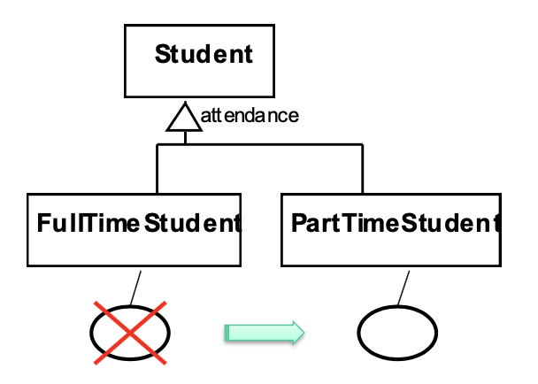

**추상 클래스**
- 추상 오퍼레이션
    * 구현이 없는 오퍼레이션
    * 기능의 정의만 있고, 실제 코드로 구현된 메소드 없음
- 추상 클래스
    * 인스턴스가 없는 클래스
    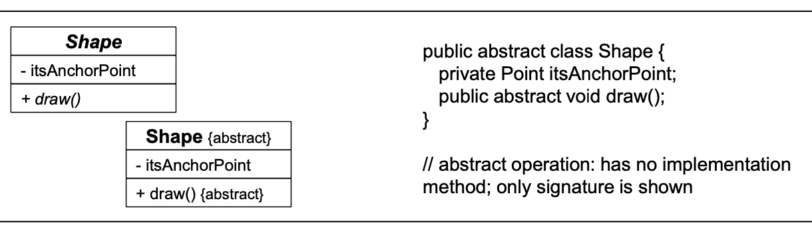

**인터페이스** 
- 인터페이스는 객체 집합이 가지는 가시적인 행위를 표현한 것
    * 인터페이스는 클래스와 유사
    * 인스턴스 변수와 구현된 메소드만 없음
    * ex)은행 창구 직원과 ATM
        + 공통 오퍼레이션을 포함, 슈퍼클래스가 다름
        + 같은 상속 구조에 위치시킬 수 없음. Cashier라는 인터페이스 특징 가짐
    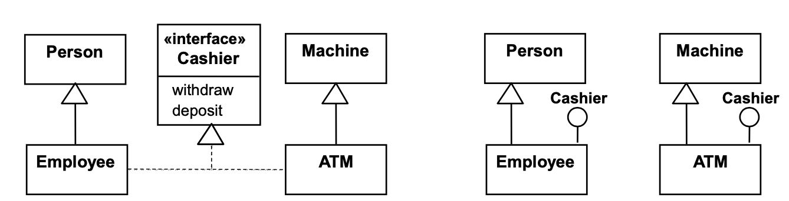

**Notes**
- 노트는 UML 다이어그램에 포함 된 작은 텍스트 블록
- 프로그래밍 언어의 주석과 같음
    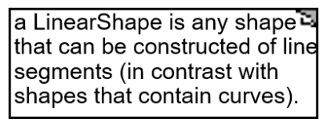

## **OCL**
소프트웨어 모듈의 제약사항을 정형적으로 나타내도록 설계된 명세 언어
- OCL은 시스템에 대한 논리적인 사실(참 값을 갖는)만 나타냄
- 제약사항에 대한 side-effect는 없음
    * 참이나 거직이 아닌 결과를 낼 수 없으며, 어떤 데이터도 수정하지 않음
- 클래스 다이어그램에 표현된 OCL 문장은 속성값이 무엇인지, 연관관계가 존재해야 하는지 등에 대하여 명세할 수 있음

 

- OCL 문장의 구성요소
    * 역할 이름, 연관관계 이름, 속성, 오퍼레이션의 결과에 대한 레퍼런스
    * 논리 진위 값: true, false
    * 논리적 연산자: and, or, =, <, >, <>(not equal)
    * 문자 스트링: 'a string'
    * 정수와 실수
    * 산술 연산자: +, -, *, /

- 다각형과 점
    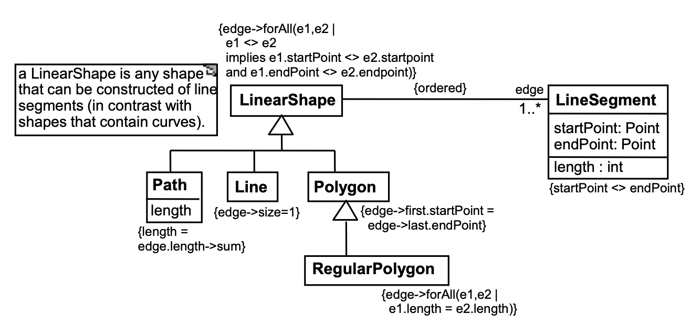